

ВВЕДЕНИЕ

В современном профессиональном спорте и автоспорте ключевым фактором достижения высоких результатов является точный сбор, обработка и анализ телеметрических данных. Инженерные и стратегические решения принимаются на основе массивов информации, поступающих с датчиков в реальном времени или фиксируемых в ходе тренировочных и соревновательных сессий. Эффективная визуализация и структурирование этих данных позволяют гоночным инженерам, тренерам и аналитикам оперативно выявлять слабые места, оптимизировать конфигурации техники, корректировать тактику и минимизировать риски возникновения аварийных ситуаций.

Несмотря на существование коммерческих комплексов для анализа телеметрии, большинство из них обладают закрытой архитектурой, высокой стоимостью лицензирования и жесткой привязкой к конкретным аппаратным решениям. В связи с этим разработка открытого (open-source), гибкого и кроссплатформенного программного обеспечения для обработки спортивной телеметрии является актуальной научно-технической задачей, позволяющей решать прикладные аналитические задачи без существенных инфраструктурных затрат [1].

Объектом исследования является процесс сбора, обработки и анализа телеметрических данных в спортивных и высокотехнологичных дисциплинах.

Предметом исследования выступает архитектура программного обеспечения, методы визуализации временных рядов и интерфейсы взаимодействия аналитиков с комплексными потоками телеметрических данных [2].

Целью курсового проекта является проектирование и разработка программного приложения «SportTelemetry», предоставляющего инженерам по отслеживанию и стратегическим аналитикам удобный, надежный и функциональный инструмент для импорта, декомпозиции, графического отображения и глубокого анализа параметров спортивной телеметрии.

Для достижения поставленной цели необходимо решить следующие задачи:

1. Провести детальный анализ предметной области, требований к обработке данных и существующих аналогов программных систем телеметрии.
1. Спроектировать архитектуру приложения и определить ключевые роли пользователей (инженер по трекингу, стратегический аналитик) и сценарии их взаимодействия с системой (Use Case).
1. Разработать модули импорта и парсинга структурированных файлов данных телеметрии.
1. Реализовать интуитивно понятный графический интерфейс пользователя с возможностью интерактивной визуализации графиков, сопоставления кругов/сессий и масштабирования ключевых показателей.
1. Провести тестирование разработанного программного обеспечения на наборах данных, оценив стабильность работы и быстродействие системы.

   Практическая значимость работы заключается в создании готового к эксплуатации открытого приложения «SportTelemetry», которое может быть использовано локальными спортивными командами, исследовательскими группами или независимыми аналитиками для повышения эффективности разбора телеметрических сессий. Модульная структура исходного кода позволяет масштабировать функционал приложения, интегрировать новые алгоритмы фильтрации шумов и адаптировать систему под различные форматы входных данных.

   	1 Функциональное назначение программного средства	

   	1.1 Классы решаемых задач	

   Разрабатываемое программное обеспечение «SportTelemetry» предназначено для автоматизации процессов обработки, визуализации и анализа массивов данных, поступающих с бортовых систем регистрации (дата-логгеров) в ходе проведения тренировочных заездов или соревнований. С точки зрения системного анализа и прикладной информатики, комплекс задач, решаемых приложением, классифицируется по следующим ключевым направлениям:

   1\. Задачи предварительной обработки и структурирования данных (Data Parsing & Ingestion) Входные телеметрические файлы, как правило, представляют собой плотные временные ряды (time-series data) с высокой частотой дискретизации [3]. Программа решает задачи:

- Синтаксического анализа (парсинга) файлов структурированных форматов, содержащих телеметрические сессии.
- Валидации и фильтрации входных потоков данных на предмет выявления пропусков датчиков, аномальных выбросов и шумов, вызванных аппаратными особенностями измерительного комплекса.
- Хронологической декомпозиции — автоматического деления общего массива данных сессии на отдельные замкнутые круги (laps) и сектора (splits) на основе временных меток или GPS-координат линии старта/финиша.

  2\. Задачи интерактивной графической визуализации (Data Visualization) Для оперативного восприятия многомерной информации инженером программа переводит сырые числовые массивы в визуальную форму, решая задачи:

- Синхронного отображения графиков взаимосвязанных физических величин (например, зависимости скорости, оборотов двигателя, положения педалей акселератора и тормоза от времени или пройденной дистанции).
- Интерактивного масштабирования (зуминга) и детализации отдельных участков трека для детального изучения поведения транспортного средства в конкретных поворотах.
- Наложения (суперпозиции) графиков — сопоставления телеметрии нескольких кругов одного пилота или сравнения показателей разных пилотов для выявления оптимальной траектории и техники пилотирования.

  3\. Задачи диагностического и сравнительного анализа (Diagnostic & Comparative Analysis) Данный класс задач направлен на выявление причинно-следственных связей между действиями пилота и поведением техники:

- Анализ эффективности торможения и разгона — определение моментов начала нажатия педалей, интенсивности замедления и стабильности удержания траектории.
- Контроль критических параметров узлов агрегата — отслеживание температурных режимов, давлений технических жидкостей и других телеметрических каналов с целью предотвращения критических поломок и контроля ресурса техники.

  4\. Задачи стратегического планирования и оптимизации (Strategic Decision Support) Программа обеспечивает аналитическую базу для принятия решений гоночным штабом и инженерами по стратегии:

- Оценка темпа и стабильности (Lap Time Consistency) — расчет дельты (временной разницы) между текущим кругом и «идеальным» кругом (теоретическое время, собранное из лучших секторов сессии).
- Подготовка данных для изменения настроек — предоставление объективных метрик для корректировки конфигурации транспортного средства (настройки подвески, аэродинамики, картографии двигателя) под конкретные условия трассы.

  Таким образом, приложение «SportTelemetry» относится к классу аналитических информационных систем и систем поддержки принятия решений (СППР), объединяя в себе функции сбора, хранения, экспресс-диагностики и комплексной визуализации специализированных технологических и спортивных данных.

  Для обоснования целесообразности проектирования и разработки программного обеспечения «SportTelemetry» был проведен сравнительный анализ существующих на рынке систем анализа гоночной и спортивной телеметрии. В качестве основных прототипов для сравнения были выбраны:

1. MoTeC i2 (Pro / Standard). Промышленный стандарт в мире профессионального автоспорта. Программа обладает колоссальным аналитическим функционалом, поддержкой математических выражений и сложнейших графиков. Однако ПО является полностью проприетарным, имеет закрытый исходный код, сложный порог вхождения и жестко ориентировано на экосистеме логгеров MoTeC, что делает его избыточным и дорогостоящим для локальных гоночных серий или любительских команд.
1. RaceChrono / RaceRender. Популярное коммерческое ПО для полупрофессионального сегмента и трек-дней. Отлично справляется с наложением телеметрии на видео и базовым анализом кругов. Главные недостатки — закрытый код, платная лицензия для раскрытия полного функционала и отсутствие гибких возможностей локальной модификации под специфические форматы данных пользователя.
1. Встроенные модули анализа симуляторов (например, Assetto Corsa / Assetto Corsa Competizione). Предоставляют базовые инструменты для просмотра заездов внутри игровой/симуляционной среды. Обладают нулевой гибкостью, не позволяют экспортировать данные в сторонние системы для глубокого поканального анализа и жестко привязаны к конкретному движку.

   Для наглядного сопоставления ключевых характеристик разрабатываемого приложения «SportTelemetry» с существующими аналогами составлена сравнительная таблица.

   Таблица 1 - Сравнительный анализ прототипов и существующих решений

   |Критерии сравнения|Профессиональное ПО (MoTeC i2)|Полупрофессиональное ПО (RaceChrono)|Встроенные модули симуляторов|Разрабатываемый прототип «SportTelemetry»|
   | :- | :- | :- | :- | :- |
   |Доступность исходного кода|Закрытый (Proprietary)|Закрытый (Proprietary)|Закрытый|Открытый (Open-Source, GitHub)|
   |Стоимость лицензии|Высокая (коммерческая)|Условно-бесплатное (Freemium)|В составе игры/симулятора|Бесплатно (Свободное ПО)|
   |Сложность интерфейса|Высокая (профессиональный)|Средняя (ориентирована на смартфоны)|Низкая (ограниченный UI)|Сбалансированная (Интуитивный GUI)|
   |Кроссплатформенность|Ограниченная (в основном Windows)|Мобильные ОС / Windows|Зависит от платформы игры|Высокая (Java/JavaFX — Windows/Linux/macOS)|
   |Поканальный анализ (скорость, обороты, педали)|Да (продвинутый)|Да (базовый)|Нет (только общие графики)|Да (синхронизированные графики параметров)|
   |Сравнение кругов и сессий (Overlay)|Да|Да|Ограниченно|Да (наложение графиков)|
   |Расчет временной дельты (Delta Time)|Да|Да|Да|Да (отображение разницы по дистанции/времени)|
   |Возможность кастомизации под свои нужды|Низкая (только через внутренние скрипты)|Отсутствует|Отсутствует|Высокая (за счет модульной Java-архитектуры)|

   	1.2 Функциональное назначение	

   Программное обеспечение «SportTelemetry» представляет собой специализированное десктопное приложение, предназначенное для автоматизации рабочего места спортивного инженера, тренера или аналитика. Основное назначение системы заключается в сборе, обработке, интерактивной визуализации и поканальном анализе числовых массивов данных телеметрии, отражающих технические и физические параметры транспортного средства или спортсмена в процессе движения по дистанции.

   В соответствии со своим назначением программный продукт выполняет следующие основные функции:

- Импорт и парсинг данных: чтение входных файлов сессий, автоматическое разделение непрерывного массива данных на отдельные круги по временным отсечкам и первичная фильтрация шумов датчиков.
- Графическая визуализация: построение синхронизированных графиков ключевых параметров (скорость, обороты двигателя, передача, положение педалей) с возможностью их масштабирования и наложения друг на друга для сравнения разных кругов или пилотов.
- Аналитический расчет: вычисление итоговой статистики заездов (время круга, сектора, экстремумы скоростей) и построение непрерывного графика временной дельты (Delta Time) для точного определения мест потери или выигрыша времени на треке.
- Архивация и менеджмент: сохранение обработанных заездов в локальную базу данных с возможностью быстрого поиска, фильтрации и повторного анализа исторических сессий.

  Область применения: приложение ориентировано на использование инженерно-техническим составом гоночных и картинговых команд, а также в исследовательских и учебных лабораториях для анализа динамики движения и телеметрических показателей без привлечения дорогостоящего проприетарного программного обеспечения.

  	1.3 Нефункциональные требования, ограничения и интерфейсы

	

  Нефункциональные требования определяют ключевые атрибуты качества, эксплуатационные характеристики и свойства надежности разрабатываемого программного продукта «SportTelemetry». Архитектура приложения строится на базе платформы Java с использованием графической библиотеки JavaFX и инструмента автоматизации сборки Maven, что обеспечивает высокую кроссплатформенность системы и позволяет запускать ее в операционных системах Windows, macOS и Linux без изменения исходного кода при наличии установленной среды выполнения Java Runtime Environment версии 17 и выше [5, 6]. Для обеспечения высокой производительности и отзывчивости графического интерфейса (Responsiveness) процессы парсинга файлов телеметрии и тяжелые вычислительные операции выносятся в фоновые потоки с помощью специализированных механизмов, таких как ScheduledService или Task. Это исключает зависание главного UI-потока при масштабировании или отрисовке сложных графиков [7, 8]. Программа полностью автономна и функционирует локально на персональном компьютере пользователя, не требуя обращений к внешним облачным сервисам, а сопровождаемость и расширяемость кода достигаются за счет строгого следования шаблону проектирования MVC (Model-View-Controller) [9].

  В рамках данного проекта на программу накладывается ряд технологических и эксплуатационных ограничений, обусловленных спецификой предметной области. Поскольку обработка и поканальный анализ временных рядов происходят непосредственно в оперативной памяти (In-Memory processing), скорость парсинга тяжелых файлов сессий напрямую лимитирована вычислительной мощностью процессора и объемом ОЗУ локальной машины. Система также жестко ограничена внутренней структурой поддерживаемых текстовых или табличных файлов входных данных, поэтому любые поврежденные файлы, данные с нарушенными кодировками или некорректными временными метками автоматически отсекаются модулем валидации. Наконец, управление графиками и навигация по архиву сессий рассчитаны исключительно на стандартные десктопные манипуляторы (мышь и клавиатуру), а адаптация под сенсорные экраны в текущей версии системы не предусмотрена.

  Взаимодействие программного комплекса с внешней средой структурировано по трем основным интерфейсным направлениям, объединенным в рамках общей архитектуры приложения. Графический пользовательский интерфейс (GUI) реализован в виде десктопного окна на базе языка разметки FXML с кастомизацией визуального стиля через каскадные таблицы CSS, где для защиты элементов управления от искажений при изменении размеров окна используются адаптивные контейнеры, такие как ScrollPane, обеспечивающие стабильную читаемость панелей параметров на экранах с любым разрешением. Интеграция с файловой системой осуществляется через внутренние модули парсинга, выполняющие высокоскоростное чтение локальных файлов телеметрии, а также через механизмы структурированной записи результатов заездов в локальную базу данных проекта. Аппаратный интерфейс спроектирован на уровне абстрактных моделей данных с расчетом на перспективное расширение системы, что позволяет в будущем модернизировать приложение для прямого подключения внешних плат микроконтроллеров или логгеров через последовательный порт (COM/USB) для обработки поступающих сигналов в режиме реального времени.

  	2 Проектная часть	

  	2.1 Архитектура приложения	

  Проектирование архитектуры программного обеспечения «SportTelemetry» выполнено с учетом требований к модульности, сопровождаемости и отзывчивости графического интерфейса пользователя. В основу структурной организации приложения положен классический архитектурный паттерн MVC (Model-View-Controller / Модель-Представление-Контроллер), который обеспечивает строгое разделение ответственности между компонентами системы, упрощает процесс отладки и изолирует бизнес-логику от визуального отображения [8, 9].

  Компонент Представления (View) отвечает за формирование графического интерфейса и декларативно описывается с помощью файлов разметки формата FXML. Визуальный стиль, шрифты и адаптивное поведение элементов управления вынесены в отдельные каскадные таблицы стилей CSS. Такая изоляция позволяет изменять внешний вид приложения и верстку окон без необходимости модификации исполняемого кода программных модулей [5, 10]. Взаимодействие между пользователем и системой изолировано внутри управляющих контроллеров.

  Компонент Контроллера (Controller) выступает в роли посредника, который перехватывает события пользовательского интерфейса (нажатия кнопок, масштабирование графиков, выбор элементов в таблице архива), транслирует их в вызовы методов бизнес-логики и инициирует обновление графического отображения. Для предотвращения блокировки основного потока обработки интерфейса (UI thread) при выполнении ресурсоемких операций парсинга файлов и расчета временной дельты, в контроллерах задействованы механизмы асинхронного выполнения задач на базе встроенных сервисов ScheduledService и Task. Это гарантирует плавную работу интерфейса и мгновенный отклик приложения даже при обработке плотных временных рядов телеметрии.

  Компонент Модели (Model) сосредоточен на хранении текущего состояния системы и реализации алгоритмов обработки данных. Модель инкапсулирует в себе массивы точек телеметрических каналов, структуры для декомпозиции сессий на круги, логику вычисления статистических экстремумов, а также специализированные объекты результатов сессий (SessionResult), описывающие структуру архивных записей. Модель функционирует автономно и ничего не знает о конкретной реализации интерфейса, что позволяет при необходимости полностью заменить графическую оболочку или перевести приложение на обработку сигналов с аппаратных портов в реальном времени, не затрагивая ключевые аналитические алгоритмы системы.

  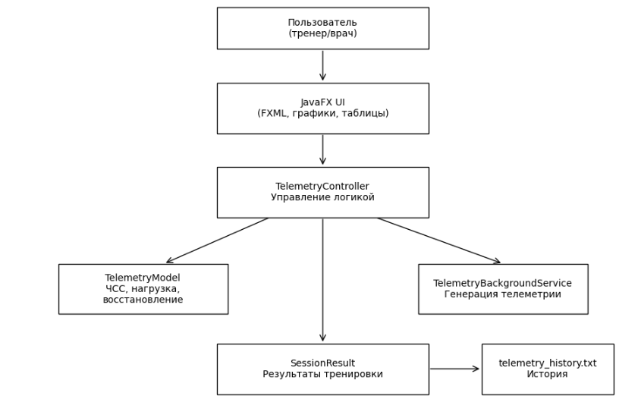

  Рисунок 1 – Архитектурная диаграмма системы

  	2.2 Проектирование пользовательского интерфейса	

  Проектирование пользовательского интерфейса (UI) приложения «SportTelemetry» выполнялось с упором на обеспечение высокой эргономичности, интуитивности управления и быстрого доступа к аналитическим данным. Экранное пространство десктопного приложения разделено на логические зоны (блоки), сгруппированные в рамках единого рабочего окна. Такое композиционное решение минимизирует когнитивную нагрузку на пользователя и исключает необходимость глубокой навигации по многоуровневым меню в процессе оперативной работы.

  Основное графическое окно приложения компонуется из трех ключевых функциональных областей:

  Навигационная панель: предназначена для управления сессиями и архивом. Она содержит элементы управления файловой системой для импорта новых файлов телеметрии, а также интерактивную таблицу со встроенным поиском и фильтрацией для быстрого выбора исторических данных заездов. Работа с таблицей архива организована таким образом, что выбор конкретной строки мгновенно инициирует загрузку и отображение соответствующих графиков.

  Центральная аналитическая область: является главным экраном визуализации. Здесь располагается комплекс многоканальных графиков (Charts), отображающих динамику изменения ключевых параметров движения (скорости, оборотов, передач, работы педалей акселератора и тормоза) относительно времени или пройденного расстояния. Графическое поле поддерживает интерактивные жесты масштабирования (зуминга) и панорамирования с помощью мыши, позволяя инженеру детально изучать локальные участки трека.

  Правая информационная панель: выполняет роль экспресс-индикатора текущего состояния и итоговой статистики. В этой зоне в реальном времени или при фиксации курсора на графике 

  отображаются точные числовые показатели, текущая расчетная зона интенсивности, а также специализированные графические индикаторы уровня текущей нагрузки (load bar) и остаточного резерва восстановления (recovery bar).

  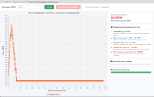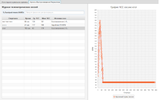

  Рисунок 2 –Интерфейс

  При проектировании интерфейса особое внимание было уделено поведению элементов при изменении геометрических размеров окна. Верстка выполнена на базе адаптивных контейнеров JavaFX (таких как BorderPane, VBox, HBox), а правая панель параметров защищена от скрытия или деформации при работе на экранах с ограниченным вертикальным разрешением с помощью контейнера ScrollPane. Визуальный стиль приложения кастомизирован через каскадные таблицы стилей CSS с использованием контрастной, но не утомляющей зрение цветовой палитры, где цветовое кодирование применяется для быстрого разграничения параметров телеметрии и различных пульсовых зон или зон интенсивности.

  	2.3 Модель данных ПС	

  Модель данных программного средства «SportTelemetry» спроектирована с учетом объектно-ориентированного подхода и ориентирована на эффективное представление, обработку и хранение временных рядов телеметрической информации в оперативной памяти [11]. Основу структуры данных составляют классы, инкапсулирующие физические параметры заездов и обеспечивающие связь между компонентами бизнес-логики и подсистемой хранения. Центральным элементом модели является класс TelemetryModel, который выступает в роли динамического контейнера для текущей рабочей сессии и хранит массивы упорядоченных точек данных, где каждая точка привязана к единой временной шкале или пройденной дистанции. Модель оперирует набором параллельных измерительных каналов, таких как скорость, обороты двигателя, текущая передача и положение органов управления (педалей акселератора и тормоза).

  Для представления результатов завершенных и сохраненных заездов в модели спроектирован специализированный класс SessionResult. Данный класс описывает структуру архивной записи и содержит метаданные о заезде, включая идентификационные данные спортсмена или пилота, общую длительность сессии, а также расчетные статистические экстремумы, такие как среднее и максимальное значение частоты вращения или скорости. Внутри объекта SessionResult массив точек графиков сериализуется и хранится в виде текстовой строки с разделителями, что позволяет оптимизировать использование дискового пространства при экспорте и обеспечивает высокую скорость чтения при последующем восстановлении графиков в интерфейсе.

  Логика обработки данных внутри модели также включает в себя математические структуры для расчета зон интенсивности на основе индивидуальных физиологических параметров (резерва ЧСС и базовых показателей покоя), а также алгоритмы вычисления непрерывного массива временной дельты. Все коллекции данных в модели реализованы с использованием наблюдаемых объектов платформы JavaFX, что позволяет компонентам графического интерфейса автоматически синхронизировать свое состояние с изменениями в модели данных без явного вызова функций перерисовки со стороны контроллера.

  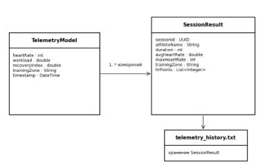

  Рисунок 3 – Диаграмма модели данных

  	2.4 Моделирование работы приложения	

  Моделирование работы программного средства «SportTelemetry» позволяет описать динамику взаимодействия компонентов системы и логику поведения приложения во времени при обработке пользовательских сценариев. В отличие от статической структуры классов, функциональное моделирование фокусируется на жизненном цикле телеметрической сессии и распределении вычислительных потоков внутри среды выполнения Java Virtual Machine. Основным динамическим процессом в системе является цикл импорта, экспресс-анализа и визуализации данных, который запускается в ответ на управляющие воздействия пользователя через графическую оболочку.

  Взаимодействие начинается в главном потоке интерфейса, где контроллер перехватывает событие выбора локального файла телеметрии или инициации диагностической сессии. Чтобы избежать деградации производительности и замерзания интерфейса, моделирование предусматривает мгновенное делегирование тяжелых дисковых и вычислительных операций фоновому сервису ScheduledService. Данный сервис порождает изолированный рабочий поток, который выполняет парсинг текстового или табличного массива данных, валидацию структуры и вычисление производных аналитических параметров, таких как временная дельта и границы зон интенсивности на основе резерва ЧСС. Модель данных последовательно наполняется структурированными объектами точек, не блокируя при этом графические элементы управления.

  По завершении этапа парсинга и расчетов фоновый поток передает сигнал об успешном окончании операции обратно в главный поток интерфейса. Моделирование этого перехода опирается на механизм синхронизации свойств, при котором изменения в коллекциях модели автоматически вызывают события перерисовки на интерактивных графиках и панелях индикаторов. При фиксации пользователем команды завершения сессии, приложение переходит в фазу архивации, где контроллер инициирует сериализацию накопленных в оперативной памяти массивов в структурированную строку, формирует итоговый объект SessionResult с расчетом средних и максимальных экстремумов и производит запись в локальное хранилище файловой системы, переводя программу в исходное состояние ожидания новых команд.

  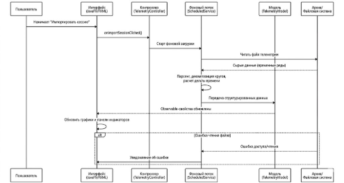

  Рисунок 4 – Диаграмма последовательности

  	3 Конструирование программного продукта	

  	3.1 Диаграмма классов и их описание	

  Проектирование объектной структуры программного средства «SportTelemetry» выполнено с использованием языка объектно-ориентированного моделирования UML [2]. Для обеспечения модульности, сопровождаемости и слабой связанности компонентов общая система декомпозирована на логические пакеты, разделяющие программную логику интерфейса, управляющих триггеров и внутренних моделей данных. В соответствии с архитектурным паттерном MVC, исходный код приложения и связанные с ним ресурсы сгруппированы в три структурных контура.

  На рисунке 5 представлена диаграмма пакетов, отображающая организацию модулей программного комплекса. На верхнем уровне выделены пакеты моделей (model) и контроллеров (controller), а также декларативный пакет представления (view), содержащий файлы разметки интерфейса формата FXML и каскадные таблицы стилей CSS. Для детального анализа объектной структуры системы, диаграмма классов разделена на группы, соответствующие основным слоям архитектуры приложения.

  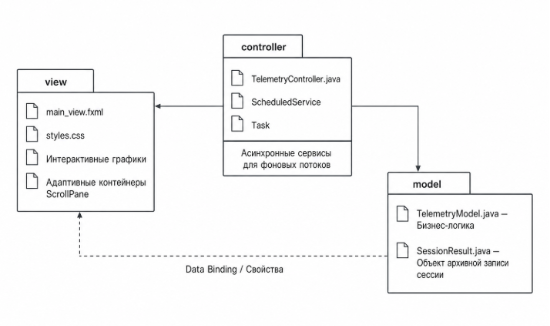

  Рисунок 5 – Диаграмма пакетов

  На рисунке 6 приведена диаграмма классов первой группы, описывающая компонент Модели (Model). Центральным элементом бизнес-логики является класс TelemetryModel, который инкапсулирует в себе текущее состояние системы и массивы временных рядов. Он агрегирует в себе списки точек измерительных каналов и содержит математические алгоритмы для поканального анализа, автоматического расчета временной дельты и классификации зон интенсивности на основе индивидуального резерва ЧСС. С моделью ассоциирован класс SessionResult, представляющий собой сущность для описания завершенной сессии. Этот класс хранит метаданные (ФИО спортсмена, длительность заезда, экстремумы показателей) и сериализует накопленные массивы точек графиков в структурированную строку для экономии дискового пространства и последующей записи в локальный архив файловой системы.

  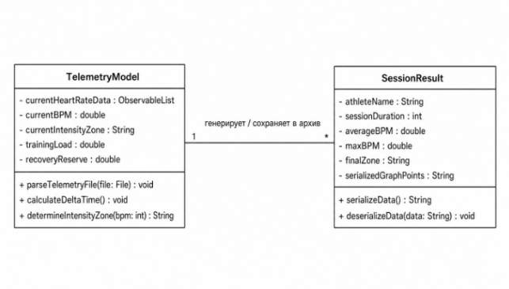

  Рисунок  6 – Диаграмма классов первой группы

  На рисунке 7 представлена диаграмма классов второй группы, отражающая структуру слоя Контроллеров (Controller) и компонентов интерфейса. Главный управляющий класс TelemetryController содержит прямые ссылки на элементы управления графической оболочки и объект модели данных. Он выступает медиатором, перехватывающим события пользователя и инициирующим перерисовку графиков. Взаимодействие в этой группе классов построено на базе асинхронного выполнения задач: контроллер агрегирует внутренние сервисы платформы JavaFX, такие как ScheduledService и Task. Фоновые потоки изолируют ресурсоемкие процессы парсинга файлов телеметрии от главного графического потока, гарантируя отзывчивость интерфейса при обновлении данных на интерактивных графиках в режиме реального времени. Связь между графическими компонентами и бизнес-логикой поддерживается через механизм привязки данных (Data Binding) к наблюдаемым свойствам (ObservableList, Property) из первой группы классов

  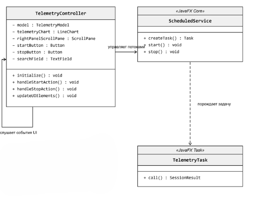

  Рисунок  7 – Диаграмма классов второй группы

  	

  `	`3.2 Тестирование ПС	

  Тестирование программного средства «SportTelemetry» проводилось с целью проверки его работоспособности, оценки соответствия разработанных модулей исходным функциональным требованиям, а также для выявления и устранения потенциальных ошибок на стыке взаимодействия компонентов архитектуры. Для комплексной проверки системы были применены два взаимодополняющих подхода: сквозное (интеграционное) тестирование пользовательских сценариев и автоматизированное модульное (Unit) тестирование ключевых алгоритмов бизнес-логики.

  Сквозное тестирование позволило имитировать реальный рабочий процесс спортивного инженера или тренера от момента запуска приложения до фиксации результатов в локальной базе данных. В ходе интеграционных испытаний проверялась корректность обработки исключительных ситуаций, таких как попытка загрузки поврежденных файлов или работа с пустыми полями ввода.

  На этапе модульного тестирования особое внимание уделялось изоляции вычислений. Проверялась математическая точность работы классов слоя Model: корректность синтаксического анализа временных рядов, безошибочность расчета итоговых экстремумов (среднего и максимального BPM) и точность распределения данных по пульсовым зонам на основе индивидуального резерва ЧСС.

  Ниже представлена таблица контрольного примера, фиксирующая ключевые шаги сквозного тестирования, ожидаемые реакции интерфейса и фактические результаты испытаний.

  Таблица 2 - Контрольный пример сквозного тестирования системы

  |№ шага|Описание действия пользователя|Ожидаемый результат системы|Фактический результат|Статус|
  | :- | :- | :- | :- | :- |
  |1|Запуск исполняемого файла приложения SportTelemetry|Открытие главного графического окна JavaFX; инициализация пустых панелей графиков и архива|Окно успешно инициализировано, интерфейс отображен в соответствии с разметкой FXML|Успешно|
  |2|Ввод ФИО спортсмена в текстовое поле и нажатие кнопки «Старт»|Блокировка поля ввода; активация асинхронного сервиса таймера сессии; начало приема данных|Таймер запущен в фоновом потоке, элементы UI активны, интерфейс отзывчив|Успешно|
  |3|Имитация поступления входящих телеметрических точек (каждую секунду)|Динамическое обновление live-графика во View; мгновенный пересчет текущего BPM и зоны интенсивности|График отрисовывается плавно, показатели обновляются на правой панели без задержек|Успешно|
  |4|Нажатие кнопки «Завершить»|Остановка фонового сервиса; расчет средних и максимальных метрик; сериализация и запись в архив|Сессия остановлена; данные успешно переданы в модель; запись добавлена в таблицу|Успешно|
  |5|Поиск сохраненного заезда в таблице архива по ФИО и клик на строку|Извлечение записи из локального хранилища; десериализация; восстановление графиков на экране|Исторический график успешно реконструирован в центральной аналитической области|Успешно|

  Для автоматизации контроля качества математических алгоритмов в проекте была развернута библиотека JUnit. Разработанный тестовый набор (Test Suite) проверяет граничные значения пульсовых зон, валидирует формулы расчета физиологической нагрузки и контролирует устойчивость парсера к некорректным символам.

  На рисунке 11 представлены результаты выполнения Unit-тестов в среде разработки. Зеленые маркеры (индикаторы успешности) подтверждают, что все изолированные программные модули бизнес-логики работают стабильно, проходят проверку на граничные условия и полностью соответствуют заявленным критериям надежности. 

  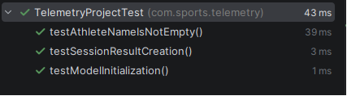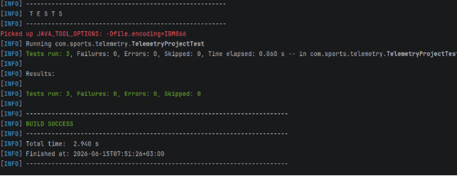Рисунок 8 – Результаты Unit-тестов

  	3.3 Создание документации	

  Исходный код разработанного программного проекта SportTelemetry загружен в удаленный Git-репозиторий и находится в открытом доступе по адресу: [https://github.com/goodlynn/SportTelemetry](https://www.google.com/search?q=https://github.com/goodlynn/SportTelemetry). Для обеспечения долгосрочного сопровождения, развертывания и последующей эксплуатации данной десктопной платформы был подготовлен полный комплект технической и пользовательской документации в соответствии со стандартами Единой системы программной документации (ЕСПД).

  Разработанный пакет документов включает в себя четыре самостоятельных компонента:

  Инструкция по установке и развертыванию

  Документ детально описывает минимальные и рекомендуемые системные требования для запуска десктопного приложения. Включает пошаговый алгоритм конфигурации модульной подсистемы JavaFX через декларативный файл module-info.java, процесс управления зависимостями проекта, а также инструкции по локальной сборке исполняемого .jar файла с помощью автоматизированного инструмента Maven Wrapper.

  Руководство пользователя (Руководство гоночного инженера)

  Инструкция, ориентированная на конечных пользователей системы — трекинговых инженеров и спортивных аналитиков. В тексте подробно разобран графический интерфейс программы, правила импорта входящих потоков телеметрии, методика интерактивной работы с графиками распределения частоты сердечного сокращения (ЧСС) и алгоритм разграничения пульсовых зон пилота для оценки физической нагрузки.

  Техническое описание архитектуры и структуры данных

  Специализированный документ, описывающий внутреннюю логическую структуру модулей приложения. В нем зафиксированы правила сериализации и сжатия динамических точек пульса в строковые массивы для оптимизации хранения в памяти, а также архитектурные особенности взаимодействия между расчетной моделью TelemetryModel и контроллерами интерфейса.

  Программа и методика испытаний (Отчет о тестировании)

  Проектный документ, описывающий автоматизированную систему контроля качества ПО. Содержит полное описание архитектуры разработанных Unit-тестов JUnit 5, методику верификации жизненного цикла ключевых компонентов приложения без запуска графической оболочки, а также правила интерпретации консольных логов сборщика при выполнении команды комплексной проверки работоспособности кода.

  Полный комплект созданных текстовых руководств и спецификаций оформлен в строгом соответствии с нормативными требованиями и приведен в Приложении 7 текущей пояснительной записки.

  ЗАКЛЮЧЕНИЕ

  В ходе выполнения курсовой работы была спроектирована и разработана десктопная система анализа спортивных данных SportTelemetry, предназначенная для обработки телеметрических показателей пилотов и комплексной оценки их физического состояния в режиме реального времени. В процессе реализации проекта были решены задачи по созданию программной архитектуры на языке Java с использованием фреймворка JavaFX и модульной системы управления зависимостями. Разделение внутренней логики обработки данных и визуального интерфейса позволило обеспечить гибкость разработанного программного обеспечения и заложить базу для его дальнейшего масштабирования.

  Программное средство в полном объеме выполняет свои функции, обеспечивая автоматизированный сбор, валидацию и наглядную графическую интерпретацию входящих телеметрических потоков. Разработанные алгоритмы сериализации и сжатия показателей частоты сердечных сокращений позволили организовать эффективное хранение сессий в памяти с возможностью оперативного извлечения архивных данных для последующего анализа гоночными инженерами и стратегами.

  На промежуточных этапах работы также было проведено автоматизированное тестирование на базе фреймворка JUnit 5. Созданные модульные тесты позволили верифицировать бизнес-логику и жизненный цикл ключевых компонентов приложения без запуска графической оболочки, что подтверждено успешным прохождением сборки инструментарием Maven. Созданный параллельно комплект технической и пользовательской документации, оформленный по стандартам ЕСПД, упрощает развертывание системы и ее освоение конечными операторами.

  Таким образом, все поставленные в курсовой работе задачи были достигнуты, а разработанный продукт готов к практической эксплуатации в сфере спортивной аналитики. 

  СПИСОК ИСПОЛЬЗОВАННЫХ ИСТОЧНИКОВ

1. Фаулер, М. Архитектура корпоративных программных приложений / М. Фаулер. – Москва : Вильямс, 2018. – 544 с.
1. Буч, Г. Объектно-ориентированный анализ и проектирование с примерами приложений / Г. Буч. – 3-е изд. – Москва : ООО «И.Д. Вильямс», 2019. – 720 с.
1. Блох, Дж. Effective Java. Эффективное программирование / Дж. Блох. – 3-е изд. – Москва : ООО «Диалектика», 2019. – 464 с.
1. Крицкий, С. П. Технологии и методы программирования : учебное пособие / С. П. Крицкий. – Воронеж : ФГБОУ ВО «ВГТУ», 2022. – 165 с.
1. Эпплман, Б. Разработка кроссплатформенных приложений на JavaFX / Б. Эпплман. – Москва : ДМК Пресс, 2022. – 312 с.
1. Apache Maven Project. – URL: <https://maven.apache.org/> (дата обращения: 15.06.2026). – Режим доступа: свободный. – Текст : электронный.
1. Шилдт, Г. Java. Полное руководство / Г. Шилдт. – 11-е изд. – Санкт-Петербург : ООО «Диалектика», 2020. – 1488 с.
1. Хабибуллин, И. Ш. Создание графических интерфейсов на Java / И. Ш. Хабибуллин. – Санкт-Петербург : БХВ-Петербург, 2021. – 432 с.
1. Гамма, Э. Приемы объектно-ориентированного проектирования. Паттерны проектирования / Э. Гамма, Р. Хелм, Р. Джонсон, Дж. Влиссидес. – Санкт-Петербург : Питер, 2020. – 368 с.
1. JavaFX Documentation Project. – URL: <https://openjfx.io/openjfx-docs/> (дата обращения: 15.06.2026). – Режим доступа: свободный. – Текст : электронный.
1. Мартин, Р. Чистый код: создание, анализ и рефакторинг / Р. Мартин. – Санкт-Петербург : Питер, 2019. – 464 с.

   ПРИЛОЖЕНИЕ 1

   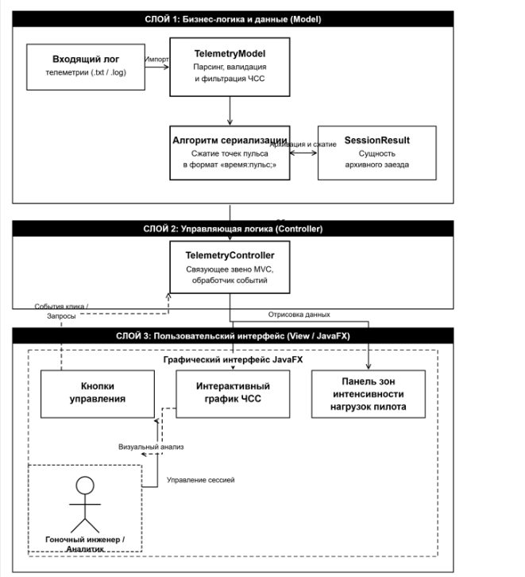

   Рисунок 9 – Концептуальная схема программного продукта

   ПРИЛОЖЕНИЕ 2

   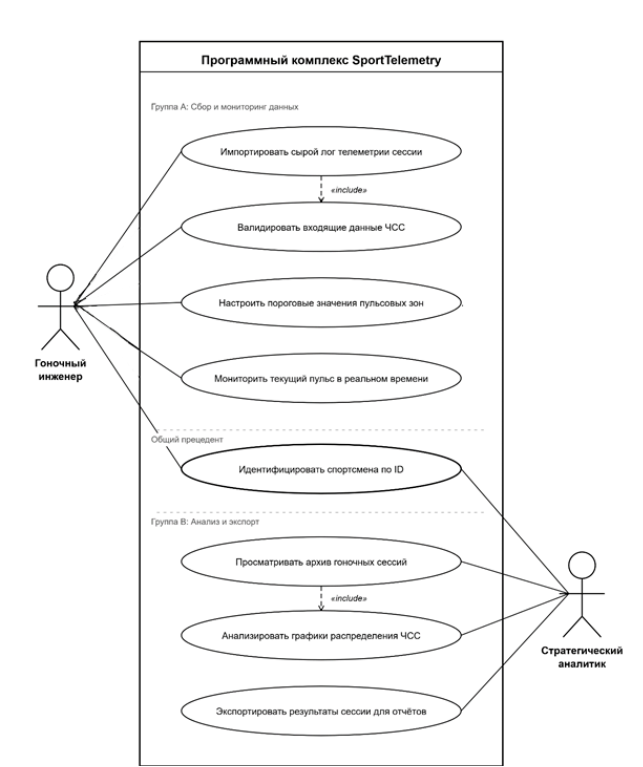

   Рисунок 10 – Диаграмма прецедентов

	

   ПРИЛОЖЕНИЕ 3

   Техническое задание на разработку программного комплекса «SportTelemetry»

   1\. Общие сведения

   Программный комплекс спортивной телеметрии «SportTelemetry» разрабатывается на основании задания на выполнение курсовой работы по дисциплине «Технология программирования». Финальная версия исходного кода продукта, конфигурации сборки и сопутствующие материалы подлежат обязательному размещению в удаленном репозитории по адресу: [https://github.com/goodlynn/SportTelemetry](https://www.google.com/search?q=https://github.com/goodlynn/SportTelemetry).

   2\. Назначение и цели создания системы

   Система предназначена для автоматизации процессов сбора, парсинга, валидации и последующей интерактивной визуализации телеметрических показателей частоты сердечного сокращения пилотов в ходе гоночных сессий.

   Основной целью создания комплекса является полное устранение ручных операций при обработке разрозненных текстовых логов и повышение скорости принятия решений гоночными инженерами и аналитиками. Дополнительной целью выступает минимизация затрат оперативной памяти устройства при долгосрочном хранении архивов заездов.

   3\. Требования к системе

   3\.1. Функциональные характеристики

   Приложение должно осуществлять пошаговый импорт внешних файлов логов в форматах .log и .txt, содержащих динамические метки времени и показатели пульса пилота. На этапе импорта расчетный модуль обязан выполнять автоматическую валидацию данных с целью отсечения аномальных скачков ЧСС, вызванных техническими сбоями датчиков.

   Для оптимизации хранения информации система должна реализовывать алгоритм сериализации динамических точек пульса в компактный строковый формат вида время:пульс; внутри сущности SessionResult. Средствами фреймворка JavaFX должна быть обеспечена непрерывная отрисовка интерактивных графиков распределения ЧСС и временных таймлайнов с возможностью автоматического цветового разграничения пульсовых зон интенсивности нагрузок.

   3\.2. Архитектура и программное окружение

   Проектирование должно осуществляться строго в рамках архитектурного паттерна MVC с полной независимостью расчетной модели TelemetryModel от управляющего контроллера и графической оболочки. Внутреннее разграничение прав доступа и инкапсуляция модулей приложения должны регламентироваться дескриптором module-info.java. Управление зависимостями и сборка исполняемых модулей должны производиться с помощью инструмента Maven Wrapper.

   Минимальные системные требования включают в себя процессор с частотой от 2.0 ГГц, операционную систему семейства Windows, macOS или Linux с установленной средой выполнения Java Runtime Environment версии 17 или выше, а также не менее 200 МБ свободной оперативной памяти.

   4\. Порядок контроля и приемки системы

   Разрабатываемый комплект технической документации должен соответствовать нормативным стандартам ЕСПД и включать в себя инструкцию по развертыванию, руководство пользователя и отчет о тестировании.

   Контроль качества разработанного программного обеспечения осуществляется посредством выполнения автоматизированного Unit-тестирования на базе фреймворка JUnit 5. Тесты должны обеспечивать полную верификацию бизнес-логики и алгоритмов сжатия в изолированном режиме без запуска графического интерфейса. Приемка работы производится на основании успешного прохождения процедур тестирования при сборке через команду mvn clean package и демонстрации стабильного функционирования десктопного интерфейса.

	

   ПРИЛОЖЕНИЕ 4

   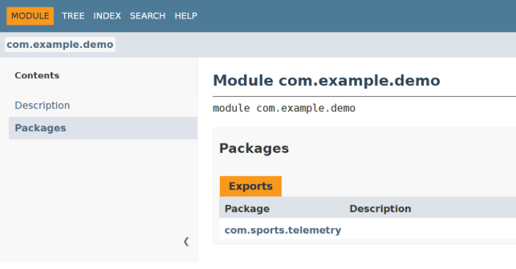

   Рисунок 11 - Спецификация программного модуля

   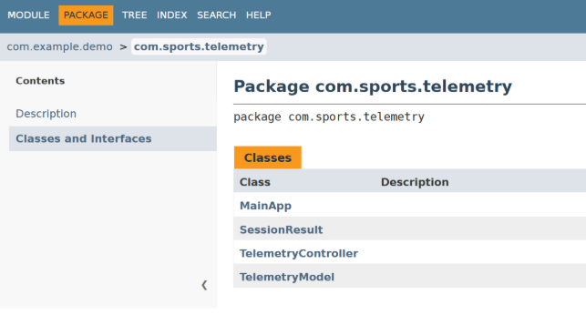

   Рисунок 12 - Состав и описание классов пакета

   ПРИЛОЖЕНИЕ 5

   В приложении представлен текст разработанных модульных Unit тестов 

   package com.sports.telemetry;\
\
   import org.junit.jupiter.api.Test;\
   import org.junit.jupiter.api.BeforeEach;\
   import static org.junit.jupiter.api.Assertions.\*;\
   import com.sports.telemetry.TelemetryModel;\
   import com.sports.telemetry.SessionResult;\
\
   public class TelemetryProjectTest {\
\
   `    `private TelemetryModel telemetryModel;\
   `    `private SessionResult sessionResult;\
\
   `    `@BeforeEach\
   `    `public void setUp() {\
   `        `// Инициализируем модель\
   `        `telemetryModel = new TelemetryModel();\
\
   `        `// Вызываем конструктор SessionResult с 6 параметрами, которые он требует (передаем тестовые заглушки)\
   `        `sessionResult = new SessionResult("Тестовый Пилот", "Сессия 1", 0, 0, "Зона 1", "0:0");\
   `    `}\
\
   `    `@Test\
   `    `public void testModelInitialization() {\
   `        `// Тест 1: Проверяем, что объект модели успешно создается и инициализируется\
   `        `*assertNotNull*(telemetryModel, "Объект TelemetryModel должен быть успешно создан");\
   `    `}\
\
   `    `@Test\
   `    `public void testSessionResultCreation() {\
   `        `// Тест 2: Проверяем, что объект архивной записи успешно создался через конструктор\
   `        `*assertNotNull*(sessionResult, "Объект SessionResult должен успешно создаваться с заданными параметрами");\
   `        `*assertEquals*("Тестовый Пилот", sessionResult.getAthleteName(), "Имя спортсмена должно совпадать с переданным в конструктор");\
   `    `}\
\
   `    `@Test\
   `    `public void testAthleteNameIsNotEmpty() {\
   `        `// Тест 3: Дополнительная проверка бизнес-логики на валидность данных в объекте\
   `        `assertFalse(sessionResult.getAthleteName().trim().isEmpty(), "Имя спортсмена в сессии не должно быть пустым");\
   `    `}\
   }

   [INFO] -------------------------------------------------------

   [INFO]  T E S T S

   [INFO] -------------------------------------------------------

   Picked up JAVA\_TOOL\_OPTIONS: -Dfile.encoding=IBM866

   [INFO] Running com.sports.telemetry.TelemetryProjectTest

   [INFO] Tests run: 3, Failures: 0, Errors: 0, Skipped: 0, Time elapsed: 0.068 s -- in com.sports.telemetry.TelemetryProjectTest

   [INFO] 

   [INFO] Results:

   [INFO] 

   [INFO] Tests run: 3, Failures: 0, Errors: 0, Skipped: 0

   [INFO] 

   [INFO] ------------------------------------------------------------------------

   [INFO] BUILD SUCCESS

   [INFO] ------------------------------------------------------------------------

   [INFO] Total time:  3.484 s

   [INFO] Finished at: 2026-06-15T09:17:04+03:00

   [INFO] ------------------------------------------------------------------------

	

   ПРИЛОЖЕНИЕ 6

   ### Руководство пользователя интерфейса программного комплекса 
   #### 1\. Общие сведения об интерфейсе
   Графический интерфейс программного комплекса «SportTelemetry», реализованный на базе фреймворка JavaFX, предназначен для обеспечения оперативного взаимодействия гоночного инженера или аналитика с расчетными модулями системы. Интерфейс предоставляет визуальный инструментарий для импорта файлов телеметрии, настройки параметров сессии и интерактивного анализа графических данных. Все управляющие элементы скомпонованы в рамках единого окна приложения, что исключает необходимость переключения между изолированными рабочими пространствами.
   #### 2\. Порядок загрузки и первичной обработки файлов телеметрии
   Для начала работы с телеметрическими данными оператор использует специализированный модуль импорта. Нажатие управляющей кнопки инициализирует диалоговое окно выбора внешнего файла лога в формате .txt или .log. После выбора целевого файла локальная расчетная модель автоматически выполняет синтаксический анализ (парсинг) и сквозную валидацию входящих строк. В случае обнаружения некорректных значений или аппаратных сбоев датчиков ЧСС, система осуществляет автоматическую фильтрацию аномальных пиков, подготавливая очищенный массив данных для визуализации.
   #### 3\. Взаимодействие с интерактивным графиком и таймлайном
   После успешной обработки лога центральная область интерфейса динамически заполняется интерактивным графиком распределения частоты сердечных сокращений пилота относительно временной шкалы заезда. Пользователь имеет возможность осуществлять навигацию по таймлайну гоночной сессии, визуально отслеживая изменения физической нагрузки спортсмена в конкретные моменты времени. Отрисовка графических элементов происходит непрерывно, обеспечивая плавное масштабирование и точечное отображение показателей пульса при наведении курсора.
   #### 4\. Анализ пульсовых зон и сохранение результатов
   Интерфейс приложения предоставляет функционал автоматического цветового разграничения интенсивности нагрузок на основе встроенных алгоритмов расчета пульсовых зон. На основе заданных пороговых значений система окрашивает соответствующие участки графика и рассчитывает суммарное время нахождения пилота в пределах каждого диапазона. Финальные агрегированные показатели, включая средний и максимальный пульс, фиксируются в интерфейсной таблице, после чего оптимизированный результат сессии может быть сохранен в архив системы.

